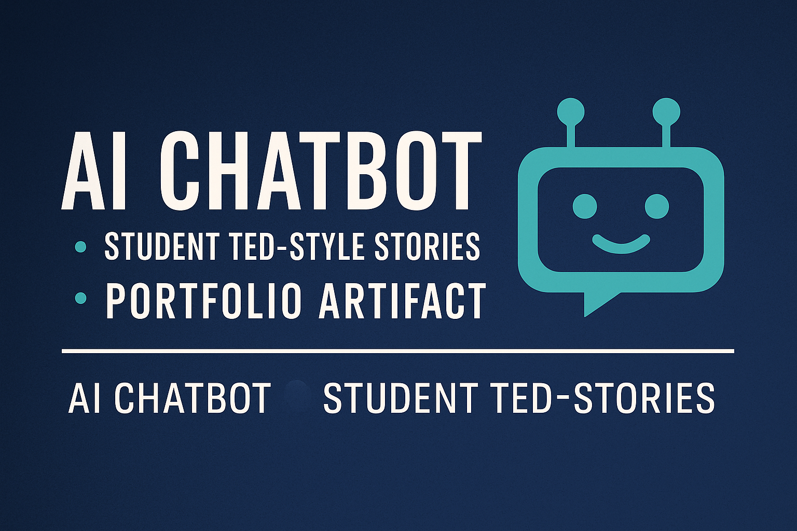

<p align="center">
  
</p>

<h1 align="center">My-Second-Artifact-Chatbox</h1>
<h3 align="center">A Collaborative AI Chatbot Built from Real Student Stories</h3>

---

# 🌟 My-Second-Artifact-Chatbox  
_A Collaborative AI Chatbot Built from Real Student Stories_

<p align="center">  
    
    
    
    
</p>

---

## 📌 Introduction  
This artifact showcases a custom AI chatbot created from TED-style presentation scripts written by multiple graduate students.  
The chatbot can:

---

## 📄 Description  
The project transforms a collection of student presentations into a structured JSON dataset, then builds a rule-based console chatbot in Python that can:  
- Answer questions about each speaker  
- Summarize their motivational message  
- Retrieve speakers by theme or topic  
- Provide personalized encouragement using each speaker’s story  

The core dataset was built by extracting, cleaning, and structuring written presentation content into a JSON file.

---

## 🧠 What the Chatbot Can Do
- ✔ Retrieve information about any speaker  
- ✔ Provide a motivational summary  
- ✔ List speakers based on themes (growth, AI, leadership, courage, etc.)  
- ✔ Respond to conversational queries using curated content  
- ✔ Demonstrate how structured text powers simple rule-based AI  

---
## 🎯 Objective  
The main goals of this artifact were to:  
- Demonstrate foundational ability to process unstructured text and convert it into structured data.  
- Build a simple, functional chatbot interface that retrieves and presents meaningful information from that dataset.  
- Illustrate how content-driven AI tools can be built without relying on heavy external NLP/ML libraries.  
- Showcase teamwork, content design, data organization, and engineering best practices.  

---
## 🔧 Process (How the Artifact Was Created)  
1. Collected multiple students’ TED-style presentation scripts (text documents).  
2. Cleaned and preprocessed the raw text: removed formatting noise, standardized metadata (speaker name, talk title, theme, summary, notes).  
3. Converted the cleaned data into a structured JSON format (`presentations.json`).  
4. Wrote a Python-based console chatbot (`chatbot.py`) implementing rule-based retrieval logic over the JSON dataset.  
5. Designed and implemented chatbot features: lookup by speaker, summarization, theme-based listing, motivational message retrieval.  
6. Documented project structure, usage examples, and skills demonstrated.  
7. Tested functionalities with various user prompts to ensure reliability.

---

## 🛠️ Technologies Used
- Python 3.x  
- JSON for structured dataset storage  
- Rule-based retrieval logic  
- Clean content preprocessing from student scripts  
- Console-based interactive chatbot  

_No external NLP libraries are required for this portfolio version._

---

## 📂 Repository Structure
```text
My-Second-Artifact-Chatbox/
│
├── data/
│   └── presentations.json
│
├── src/
│   └── chatbot.py
│
├── README.md
└── requirements.txt
```

---

## 🎤 Speaker Themes Included  
The dataset includes themes such as:

- Personal Growth  
- Courage and Overcoming Fear  
- Cultural Identity  
- AI and Technology  
- Leadership  
- Faith and Purpose  
- Career Pivoting  
- Motivation & Encouragement  

Each speaker record includes:

- Name  
- Talk Title  
- Theme  
- Summary  
- Optional notes  

---

## 💬 Example Chatbot Prompts
Try prompts like:

- “Tell me about Amber’s talk.”  
- “Which speakers talked about courage?”  
- “Summarize Emmanuel’s message.”  
- “Give me motivation about growth.”  
- “List speakers who mentioned AI.”  

---

## 🧰 Skills Demonstrated  

### **Technical Skills**
- Parsing and structuring unstructured text  
- Creating custom JSON datasets  
- Building rule-based conversational agents  
- Python scripting  
- Designing a clean, reusable architecture  

### **Professional Skills**
- Collaboration with team members  
- Content design and organization  
- Documentation and presentation  
- Converting raw inputs into usable digital products  

---

## 🔑 Unique Value  

- **Content-driven approach:** Instead of relying on heavy ML/NLP frameworks, this chatbot leverages raw human-generated stories, demonstrating that meaningful interactive tools can be built with simple but well-structured data and rule-based logic.  
- **Bridging human stories and technology:** By integrating motivational, personal content with programming logic, this artifact reflects a human-centered design mindset — an often undervalued but important skill in AI and software development.  
- **Demonstrates versatility:** The chatbot shows capability in data wrangling, software design, user interaction, and documentation — combining soft content skills with technical execution.  

---

## 📌 Relevance to My Career Goals  

This chatbot artifact aligns with my trajectory as an AI/Data Analytics practitioner aiming to build real-world applications that integrate human-centric data with engineering solutions. It demonstrates foundational competencies in:

- Data preprocessing & structuring  
- System design and software development  
- Content-aware AI tool development  
- Bridging domain knowledge (human stories, motivation, themes) with technical deployment  

Such skills are transferable to more advanced AI/ML systems, intelligent content tools, data-driven applications, and roles that require empathy + technical acumen.

---

## 🪞 Reflection  
I selected this project as my second portfolio artifact because it demonstrates my ability to:

- Clean and structure raw textual content  
- Design a functional AI-style system  
- Understand how structured data influences chatbot behavior  
- Collaborate effectively on a shared technical project  

This experience strengthened my confidence in content-driven AI solutions and set the foundation for more advanced chatbot systems in the future.

---

## 📄 License  
This project is part of an academic portfolio submission.  

